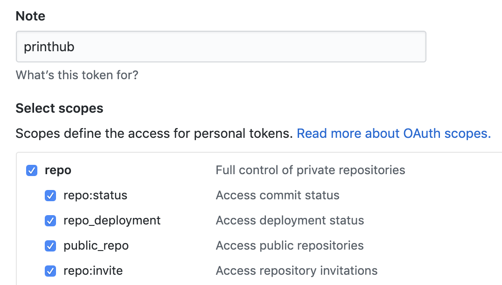

## Installing

- Go to `chrome://extensions/`
- Enable `Developer mode` in the top right
- In the top left click `Load unpacked`
- Navigate to this project folder
  

## Running
If you have a private repo, you need to add a personal Github Token by clicking the extension icon in the top right of the browser.

You can create a token by going to [your github profile -> settings -> developer settings -> personal access tokens](https://github.com/settings/tokens). Label it something like 'github printer' so you remember what it's for, and check the Repo box to give it full repo permission.

If you have more than one org on a single board, you need to add ALL your orgs by clicking the extension icon in the top right of the browser
 - Add them as a comma seperated list, without spaces `'org1,org2'` 

## TODO

- Make work on zenhub page without zenhub plugin
- Display markdown
- Error handling